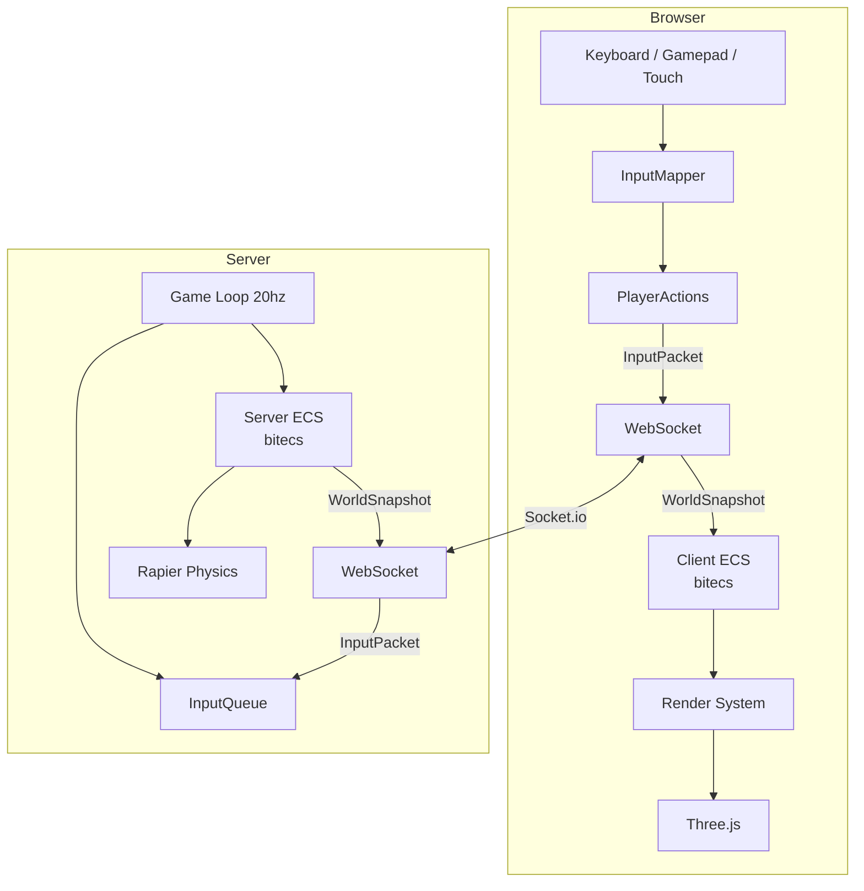

# Mayhem — Architecture

A multiplayer 3D open-world game that runs in the browser. You join, you're dropped into a shared world with everyone else, you run around, shoot things, goof off. Built to be played with family, extended whenever the mood strikes, and never turned into a chore.

The design goal is a foundation strong enough that new ideas are easy to act on. When someone says "what if it rained bananas" the answer should be "give me an hour", not "we'd have to refactor the network layer".

---

## What it is

An always-online shared world. One server, one world, everyone in it together. No lobbies, no sessions — you open the browser and you're there.

The world is a gently rolling landscape generated from a seed. Same seed, same world every time. Players appear as blocky characters. You can move around, shoot, interact with things, and watch physics happen. The game runs at a fixed server tick rate so it behaves consistently regardless of what framerate anyone's running at.

Controls work on keyboard/mouse, gamepad, and touch — whichever you have. The game doesn't care how input arrives, it only cares what action you're taking.

---

## Stack

| Concern | Choice | Why |
|---|---|---|
| Rendering | Three.js | Industry standard web 3D, huge community, close to the metal |
| ECS | bitecs | Fastest JS ECS, cache-friendly typed arrays, widely used in web games |
| Physics | Rapier.js | Rust/WASM, best performance available, renderer-agnostic |
| Multiplayer | Socket.io | Industry standard WebSockets, handles reconnects |
| Server | Node.js + TypeScript | Same language both sides, share types directly |
| Bundler | Vite | Fast HMR, standard |
| Hosting | Docker on Hetzner VPS | Self-hosted, already paid for, deploy via Portainer |

Single Docker container: Express serves the compiled client, Socket.io runs on the same HTTP server. Split into separate containers if there's ever a reason.

---

## How it works

### The server is the authority

The server owns all game state. Clients send inputs. The server simulates. The server broadcasts results. Clients render what the server says. This is the industry standard for multiplayer games — it keeps everyone in sync and makes cheating hard.

### Fixed tick rate

The server runs at **20hz** — one simulation step every 50ms. This makes behaviour predictable and load stable. A player causing absolute chaos on their end doesn't cost the server more than a player standing still: both have their inputs processed once per tick. Entity count is what scales server cost, not how dramatic the action is.

### Inputs, not positions

Clients never send "I moved here". They send "here's what I was pressing at this moment":

```typescript
// shared/types.ts
interface InputPacket {
  sequenceNumber: number  // enables client-side prediction later, costs nothing now
  timestamp: number       // client clock; used for prediction reconciliation later
  actions: PlayerActions  // what is pressed/held this frame
}

interface PlayerActions {
  moveForward: boolean
  moveBack: boolean
  moveLeft: boolean
  moveRight: boolean
  jump: boolean
  shoot: boolean
  aim: boolean
  interact: boolean
}
```

The server moves the player by `velocity × dt` where `dt` is the real elapsed time since the last tick — measured by the server's own clock, not assumed to be exactly 50ms. Event loop jitter means ticks arrive slightly early or late; using real dt keeps physics accurate. A 144hz player and a 30hz player are identical to the server — movement speed is never tied to client framerate.

### ECS on both sides

Both client and server use [bitecs](https://github.com/NateTheGreatt/bitECS). Entities are integer IDs. Components are typed arrays (`Position.x[eid]`). Systems are pure functions over queries. This is the pattern:

```
entity 42 has: Position, Velocity, Health, IsPlayer
entity 7 has:  Position, Collider, IsTree
entity 91 has: Position, Velocity, IsBullet
```

Adding a new kind of thing means adding components and a system. Nothing else changes. bitecs `Changed()` queries mean systems skip entities that haven't changed, so a world full of static trees costs almost nothing per tick.

Rapier sleeping bodies complement this: physics objects that haven't moved stop being simulated until something disturbs them. You get a large world essentially for free.

### Shared terrain generation

The terrain is generated from a seed using simplex noise. The generation function lives in `shared/` and runs on both client and server with the same seed. No terrain data crosses the network — just the seed on connect. Client generates the Three.js mesh, server generates the Rapier heightfield, they're guaranteed to match.

### The network contract

These types in `shared/` are the contract between client and server. Both sides import them. Neither side can drift from them without a compile error.

```typescript
// shared/types.ts
interface WorldSnapshot {
  tick: number        // server tick counter; enables delta compression later
  timestamp: number   // server clock; used for interpolation timing
  entities: EntitySnapshot[]
}

interface EntitySnapshot {
  id: number          // server-assigned; client mirrors this ID in its own ECS
  type: 'player' | 'projectile' | 'prop'
  position: { x: number; y: number; z: number }
  rotation: { x: number; y: number; z: number; w: number }
  health?: number
}
```

Entity IDs are assigned by the server. The client never invents entity IDs — it creates local ECS entities that mirror the server's IDs. When an entity disappears from the snapshot it gets cleaned up on the client.

The `sequenceNumber` on every input packet and `tick` on every snapshot cost nothing now and are what make client-side prediction and delta-compressed snapshots possible later — without changing the protocol.

---

## How it's structured

```
mayhem/
  packages/
    client/    # Three.js game, runs in browser
    server/    # Node.js game server
    shared/    # Types, terrain gen, constants — imported by both
  Dockerfile
  docker-compose.yml
```

`shared/` is the backbone of correctness. Any type that crosses the network lives there. Client and server can never disagree on what a player or snapshot looks like.

---

## System diagram



---

## Design areas

These are the distinct areas of the system. Not epics or tickets — just the natural seams where responsibilities separate. When we dig into any of these more deeply, each gets its own document.

**Engine core** — ECS component definitions (`Position`, `Health`, `Velocity` etc.) live in `shared/` and are imported by both sides. The server runs the full simulation: inputs, physics, game logic. The client does not simulate — it receives snapshots from the server and renders them. The client has its own lightweight ECS loop for visual-only entities (effects, particles) that the server doesn't know about. When client-side prediction is added later, the client will also run a local simulation for the local player's own movement — but that's additive, not a redesign.

**Networking** — the Socket.io layer, snapshot broadcast, input packet queuing, the protocol itself. The bridge between client and server.

**Input** — translating devices (keyboard, gamepad, touch) into `PlayerActions`. Solved once here, invisible everywhere else.

**Terrain** — simplex noise heightmap generation from a seed. Runs in `shared/`, consumed by physics (heightfield collider) and rendering (Three.js mesh). Same function, both sides.

**Physics** — Rapier integration, dynamic colliders for players and projectiles, collision events. Terrain heightfield is built here from terrain data.

**Rendering** — Three.js scene, FPS camera, materials, lighting, shadows. Terrain mesh is built here from terrain data. Post-processing effects live here too.

**Entity factories** — one function per entity type that defines everything it is: components, initial values, physics shape, model. `spawnCow(world, x, y, z)` adds the entity, attaches `Health`, `Renderable`, `WanderBehaviour`, and a physics collider in one place. This is the standard **prefab** pattern (Unity calls them prefabs, Unreal calls them blueprints). Adding a new thing to the game means adding a factory function — nothing else needs to change. Because bitecs components are typed arrays of numbers, model types are stored as a numeric enum in `shared/models.ts` (`COW = 1`, `OAK_TREE = 2` etc.) that both server and client import. The server stores the number on the entity, the snapshot carries it, the client looks it up in its asset registry.

**Game systems** — the actual game: player movement, jumping, shooting, projectiles, health, whatever we invent next. This is where the fun stuff goes.

**Deployment** — Dockerfile, docker-compose for local dev, GitHub Actions to build and push the image, Portainer on Hetzner to redeploy.

---

## Assets and animation

3D models are **GLB files** (binary GLTF — the web standard for 3D assets). They bundle geometry, materials, textures, and skeletal animations in a single file. Three.js loads them with `GLTFLoader`. They live in `packages/client/assets/` and are served as static files.

The server never sees models. It works with primitive physics shapes — a capsule for a player, a box for a cow. The client has the actual GLB and plays animations on top of whatever position the server says the entity is at.

**Animations** are clips embedded in the GLB file (e.g. `"walk"`, `"idle"`, `"jump"`). Three.js plays them via `AnimationMixer`. The client derives which clip to play from entity state — if the cow's velocity is above zero, play `"walk"`, otherwise play `"idle"`. The walk animation plays in place; the physics is what actually moves the cow. Walk animation playback speed is scaled to match actual velocity so feet don't slide.

This is a standard animation state machine — the same pattern Unity and Unreal use.

**Where to get models:**

- **[Kenney.nl](https://kenney.nl)** — the go-to for this project. Massive library of CC0 (free, no attribution needed) low-poly assets: nature, farm animals, buildings, characters, vehicles. Blocky style, exactly the aesthetic we're going for. First stop for almost everything in the world.
- **[Quaternius](https://quaternius.com)** — free CC0 animated character and animal packs. Has a cow. Humanoid characters come with walk/run/jump/idle cycles already baked in. Exports GLB directly.
- **[Mixamo](https://www.mixamo.com)** (Adobe, free) — for the player character. Upload any humanoid mesh, it auto-rigs it and provides hundreds of animations. The easiest way to get a fully animated player without any modelling knowledge.
- **[Poly Pizza](https://poly.pizza)** — curated free low-poly models, quick to browse when you need something specific.

For MVP: Kenney + Quaternius for world props and creatures, Mixamo for the player character. No 3D modelling skills required.

---

## Architecture stress tests

A few hypothetical scenarios walked through to verify the design holds. These are not a roadmap — just proof that the foundation doesn't break under fun ideas.

**A cow that follows players and shoots bananas** — new `FollowTarget` and `ShootsBananas` components, a `spawnCow` factory, a `FollowSystem` and `BananaShootSystem` on the server. New `ModelType.BANANA` and a GLB in the client registry. Nothing else changes.

**A pilotable airplane** — new `Vehicle`, `Pilotable`, and `Mounted` components. When a player enters a plane, `PlayerMovementSystem` skips them and `VehicleControlSystem` reads their inputs instead, applying them to the plane's physics body. `PlayerActions` gains two fields: `enter` and `exit`. Everything else unchanged.

**A rocket launcher with a visible explosion and loud boom** — rocket is a standard projectile with an `Explosive` component. On collision, server spawns a short-lived `Explosion` entity (despawns in 0.5s). Rapier spatial query finds nearby entities and applies an outward impulse scaled by distance. On the client, when an `Explosion` entity appears in the snapshot, the render system plays a particle effect and the sound system plays a spatial boom via Web Audio. Server never thinks about visuals or sound.

**Player-built destructible structures** — blocks placed by players are standard entities with a `Snappable` component. When placed near another block's snap point the server creates a Rapier `FixedJoint` between them — the structure now moves as one under physics. A `JointBreakSystem` monitors forces each tick and removes joints that exceed `snapStrength`. Joints are relationships between two entities, so they live in a side `Map` rather than ECS components — the right tool for that shape of data. The client has no knowledge of joints; it just sees positions update in snapshots and renders whatever chaos results.

---

## Where we are now vs where this could go

**Now:** drop into a world, run around, shoot, see other players, physics works, gamepad works, deploy it.

**Later, whenever:** client-side prediction for snappier feel on higher latency, delta-compressed snapshots for efficiency, chunk streaming for a truly infinite world, biomes and weather, NPCs with some behaviour, day/night cycle, inventory and interactions, sound, mobile touch controls, whatever sounds fun that day.

None of the "later" stuff requires rearchitecting the foundation. That's the point.

---

## Deployment

```
git push to main
  → GitHub Actions builds Docker image
  → pushes to GitHub Container Registry (free)
  → hit Redeploy in Portainer on Hetzner VPS
```

`docker compose up` locally for development. No external dependencies.
